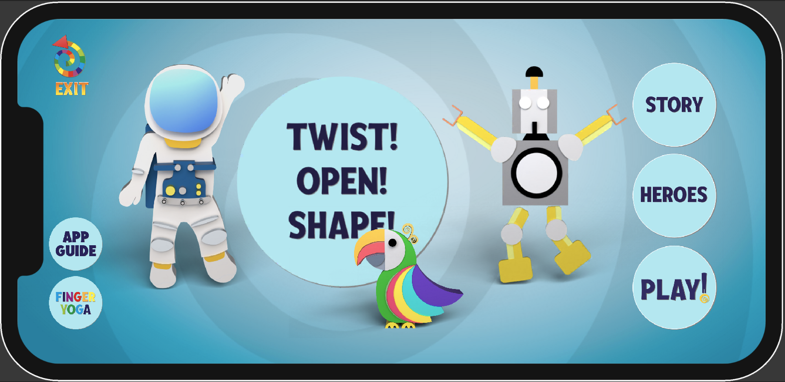

# Kucheriki Kids Game



Kucheriki Kids Game – это детская игра с возможностью выбора героев и поддержкой дополненной реальности (AR) на основе технологии Vuforia. Проект разработан на Unity 6.

## 📄 Содержание
- [Установка и запуск](#установка-и-запуск)
- [Особенности игры](#особенности-игры)
- [Addressables](#addressables)
- [Технологии](#технологии)
- [Требования](#требования)
- [Как играть](#как-играть)

---

### 🚀 Установка и запуск

1. Скачайте и установите `Unity 6`  
   https://unity.com/download

2. Клонируйте репозиторий:
   ```bash
   git clone https://github.com/your-repo/Kucheriki-kids-game.git
